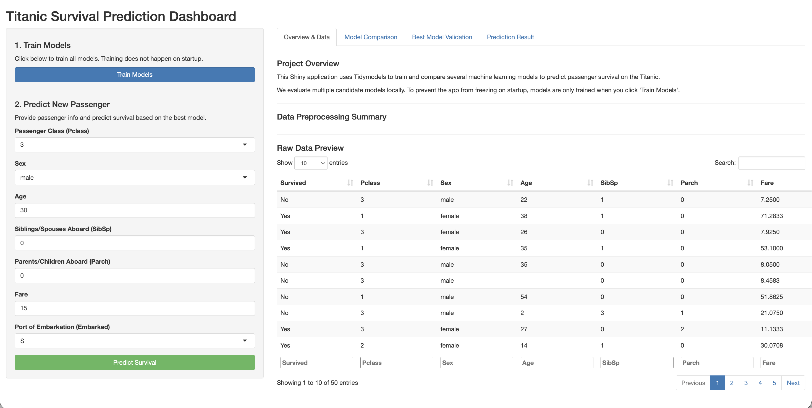
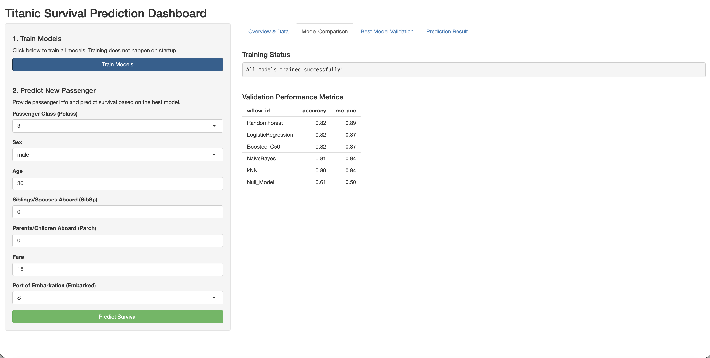
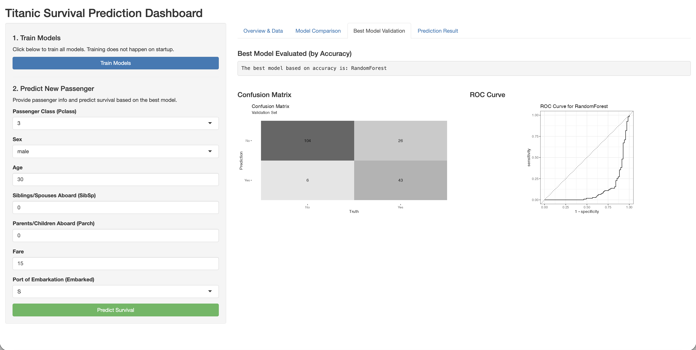
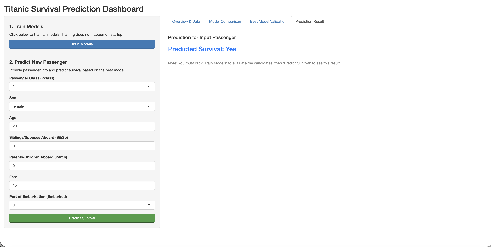

## Step 1: State the Problem

The sinking of the Titanic is one of the most famous shipwrecks in history. While navigating a dataset of passengers, our primary objective is to build a classification model to predict passenger survival based on factors like age, sex, passenger class, and fare. To make this predictive model accessible and interactive, the goal of this project was to construct a Shiny application. This dashboard serves as a front-end interface to train, evaluate, and compare multiple machine learning models seamlessly, and allows an end-user to input custom passenger details to retrieve an instant survival prediction.

## Step 2: Prepare the Data

We used the standard `titanic_train` dataset from the `titanic` R package. Before fitting any models, we established a reproducible preprocessing pipeline using the `recipes` package from `tidymodels`. 

First, the response variable (`Survived`) was converted into a factor with levels "No" and "Yes". The feature `Pclass` was also converted into a factor. Missing numeric values (such as `Age` and `Fare`) were imputed using the median, while categorical blanks (like `Embarked`) were imputed with the mode. Next, we created dummy variables for all nominal predictors (`Pclass`, `Sex`, and `Embarked`) and normalized all numeric predictors to ensure scale-sensitive models (like kNN and Regularized Logistic Regression) performed correctly. The data was split into an 80% training set and a 20% validation set to properly evaluate the models on unseen data.

## Step 3: Train Candidate Models

To find the most effective algorithm for our predictions, we trained a diverse set of six candidate models using the `tidymodels` framework. The models selected were:

1. **Null Model**: Serves as our baseline, simply predicting the majority class.
2. **k-Nearest Neighbors (kNN)**: A distance-based model predicting survival based on similarities to nearby passengers.
3. **Boosted C5.0**: A tree-based boosting algorithm that builds sequential decision trees.
4. **Random Forest**: An ensemble method using multiple decision trees to reduce variance and improve accuracy.
5. **Regularized Logistic Regression**: A linear approach penalizing extreme coefficient values to prevent overfitting.
6. **Naive Bayes**: A probabilistic classifier based on applying Bayes' theorem with strong independence assumptions.

These models were bundled into a `workflow_set` and mapped across our preprocessing recipe on the training data.

## Step 4: Compare Models

Once trained, each model was evaluated on the 20% validation split. Our primary performance metric was Accuracy, but we also tracked ROC AUC (Area Under the Receiver Operating Characteristic Curve) to better understand class separation.

The validation results were as follows:

| Model | Accuracy | ROC AUC |
| :--- | :--- | :--- |
| **RandomForest** | 0.82 | 0.89 |
| **LogisticRegression** | 0.82 | 0.87 |
| **Boosted_C50** | 0.82 | 0.87 |
| **NaiveBayes** | 0.81 | 0.84 |
| **kNN** | 0.80 | 0.84 |
| **Null_Model** | 0.61 | 0.50 |

As shown in the table, our baseline Null Model achieved an accuracy of 0.61, meaning about 61% of our validation set did not survive. All our machine learning models comfortably outperformed the baseline. Interestingly, Random Forest, Logistic Regression, and Boosted C5.0 all tied for the highest accuracy at 82%. 

## Step 5: Finalize the Model and Interpret Results

Because accuracy alone resulted in a three-way tie for the top spot, we used ROC AUC as our secondary metric to break the tie. Random Forest achieved the highest ROC AUC (0.89) compared to Logistic Regression and Boosted C5.0 (both at 0.87). Therefore, we selected **Random Forest** as the final and best model for our Shiny application.

Evaluating the Random Forest model's predictions against the actual validation dataset provides the following confusion matrix:

* **True Negatives** (Pred No / True No): 104
* **False Positives** (Pred Yes / True No): 6
* **False Negatives** (Pred No / True Yes): 26
* **True Positives** (Pred Yes / True Yes): 43

The model is very effective at correctly identifying passengers who did not survive (only 6 false positives). However, it struggles slightly more with identifying passengers who did survive, as seen by the 26 false negatives. In the context of the Titanic, survival was heavily influenced by sex (women were prioritized) and class (first-class passengers had better access to lifeboats). The Random Forest model is likely picking up deeply embedded, non-linear interactions among these variables (like a young male in third class vs. an older female in first class). Using this finalized model, the Shiny app successfully accepts new passenger inputs and reliably classifies their expected survival outcome.

## Use of Agentic Programming Tool

For this assignment, I used Google Antigravity as an agentic programming tool to assist in building the Shiny dashboard. I provided a natural-language prompt describing the Shiny app requirements, including the specific `tidymodels` framework, the tabs needed, and interaction rules. Antigravity generated the initial app structure and the reactive server logic. Afterward, I tested the generated code locally in RStudio, reviewed the implementation, and corrected minor errors to ensure it functioned exactly as needed. This approach helped me lay down the boilerplate efficiently while ensuring the final logic was accurate and met project standards.

## Application Screenshots

Below are placeholders for screenshots demonstrating the functionality of the built Shiny application.









## Appendix

### Antigravity Prompt Used

```text
Build a single-file R Shiny app named app.R for my Project4_Titanic_Shiny folder.

Context:
- I already have Tidymodels code from my midterm assignment for Titanic survival prediction.
- The project goal is to build a Shiny front end that uses Tidymodels code to train and compare models predicting Titanic passenger survival.
- Candidate models:
  1. Null model
  2. kNN
  3. Boosted C5.0
  4. Random Forest
  5. Regularized Logistic Regression
  6. Naive Bayes
- Response variable: Survived
- Use the titanic training data from the titanic package.
- Compare models using validation performance with accuracy.

Requirements:
Create a runnable single-file app.R. Use shiny, tidyverse, and tidymodels. Organize into tabs (Overview, Data Prep, Train Models, Model Comparison, Best Model, Predict New). Add a validate button to trigger training. Show inputs for a new passenger and output the prediction from the best model. Do not depend on objects already loaded in memory.
```

### Generated Code Summary

The agent drafted a complete, standalone `app.R` script containing both the UI snippet (using a `sidebarLayout` and `tabsetPanel`) and server logic. It successfully brought in `tidymodels` and `recipes` to preprocess the `titanic_train` dataset, defined the six candidate parsnip models, and bundled them using workflow workflows. On the server side, it implemented error-handling with `purrr::imap` to safely fit models, extract validation metrics to populate comparison tables, and dynamically identify the best performing model based on accuracy to use for live reactive predictions.
